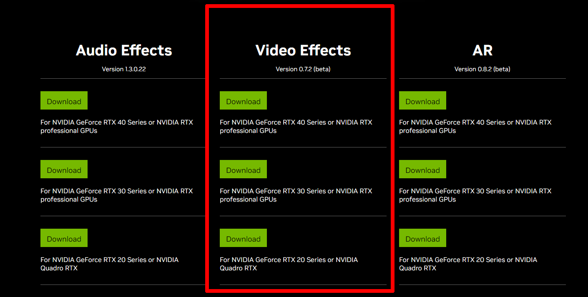
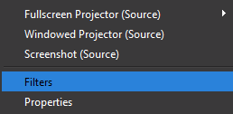
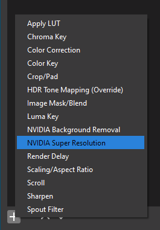
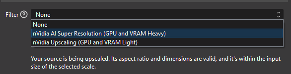
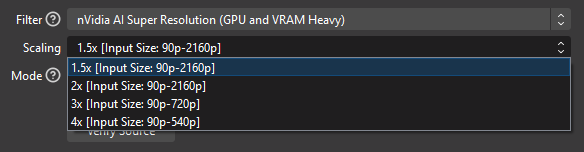
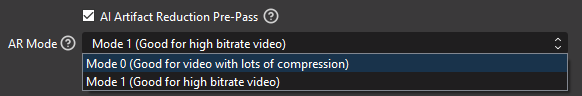
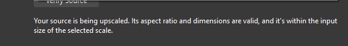
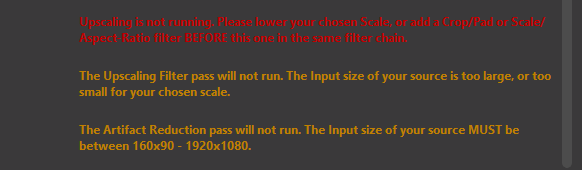

# OBS RTX Super Resolution

An Open Broadcaster Software (OBS) plugin to enable nVidia RTX Video Super Resolution features as an OBS filter.

https://blogs.nvidia.com/blog/2023/02/28/rtx-video-super-resolution/

## Features:
  nVidia Artifact Reduction Filter pre-pass: https://docs.nvidia.com/deeplearning/maxine/vfx-sdk-programming-guide/index.html#artifact-red-filter  
  nVidia Super Resolution Filter: https://docs.nvidia.com/deeplearning/maxine/vfx-sdk-programming-guide/index.html#super-res-filter  
  nVidia Upscaling Filter: https://docs.nvidia.com/deeplearning/maxine/vfx-sdk-programming-guide/index.html#upscale-filter  

## Examples:
See the [Examples Gallery](https://github.com/Bemjo/OBS-RTX-SuperResolution-Gallery)  

## Prequisites:
* OBS version 29.1.2 or higher  
* An nVidia RTX GPU (2060 or better)  
* Windows. (Linux and MacOS are not supported currently.) 
* The nVidia Video Effects SDK for your GPU, this can be obtained here https://www.nvidia.com/en-us/geforce/broadcasting/broadcast-sdk/resources/  



## Installation:
* Copy the files over your obs-studio installation folder

## Usage

1. Add a filter to a source.  
  

2. Add NVIDIA Super Resolution.  
  

3. Select Upscaling Type.  
  

4. Choose a scale that is valid for your source resolution.  
  

5. Optional. Apply Artifact Reduction pre-pass and select AR Mode.  
  * NOTE: Artifact Reduction has more limited resolution ranged available to it - your sources cannot be smaller than 160x90 or larger than 1920x1080 if you wish to use Artifact Reduction  
  

6. Click Verify Source Button.
  * If you get a white message, your source is being upscaled. You can also verify this visually in OBS if your source resizes in the scene.  
  
  * If you get other messages, your source is NOT being upscaled. You will need to select a different scaling option, or apply a Scale/Aspect Ratio filter BEFORE this NVIDIA SuperResolution filter to resize your source before this filter has a chance to process it.  
  

###  From the nVidia video fx sdk itself, here are some general recommendations
 ```
    If a video without encoding artifacts needs a fast resolution increase, use Upscale.
    If a video has no encoding artifacts, to increase the resolution, use SuperRes with mode 1 (strong) for greater enhancement.
    If a video has fewer encoding artifacts, to remove artifacts, use ArtifactReduction only with mode 0.
    If a video has more encoding artifacts, to remove artifacts, use ArtifactReduction only with mode 1.
    To increase the resolution of a video with encoding artifacts:
        For light artifacts, use SuperRes with mode 0 (weak).
        Otherwise, use ArtifactReduction followed by SuperRes with mode 1.
```

## Build System Configuration

To create a build configuration, `cmake` needs to be installed on the system. The plugin template supports CMake presets using the `CMakePresets.json` file and ships with default presets:

* `windows-x64`
    * Windows 64-bit architecture
    * Defaults to Qt version `6`
    * Defaults to Visual Studio 17 2022
    * Defaults to Windows SDK version `10.0.18363.657`
* `windows-ci-x64`
    * Inherits from `windows-x64`
    * Enables compile warnings as error
* `linux-x86_64`
    * Linux x86_64 architecture
    * Defaults to Qt version `6`
    * Defaults to Ninja as build tool
    * Defaults to `RelWithDebInfo` build configuration
* `linux-ci-x86_64`
    * Inherits from `linux-x86_64`
    * Enables compile warnings as error
* `linux-aarch64`
    * Provided as an experimental preview feature
    * Linux aarch64 (ARM64) architecture
    * Defaults to Qt version `6`
    * Defaults to Ninja as build tool
    * Defaults to `RelWithDebInfo` build configuration
* `linux-ci-aarch64`
    * Inherits from `linux-aarch64`
    * Enables compile warnings as error

Presets can be either specified on the command line (`cmake --preset <PRESET>`) or via the associated select field in the CMake Windows GUI. Only presets appropriate for the current build host are available for selection.

Additional build system options are available to developers:

* `ENABLE_CCACHE`: Enables support for compilation speed-ups via ccache (enabled by default on macOS and Linux)
* `ENABLE_FRONTEND_API`: Adds OBS Frontend API support for interactions with OBS Studio frontend functionality (disabled by default)
* `ENABLE_QT`: Adds Qt6 support for custom user interface elements (disabled by default)
