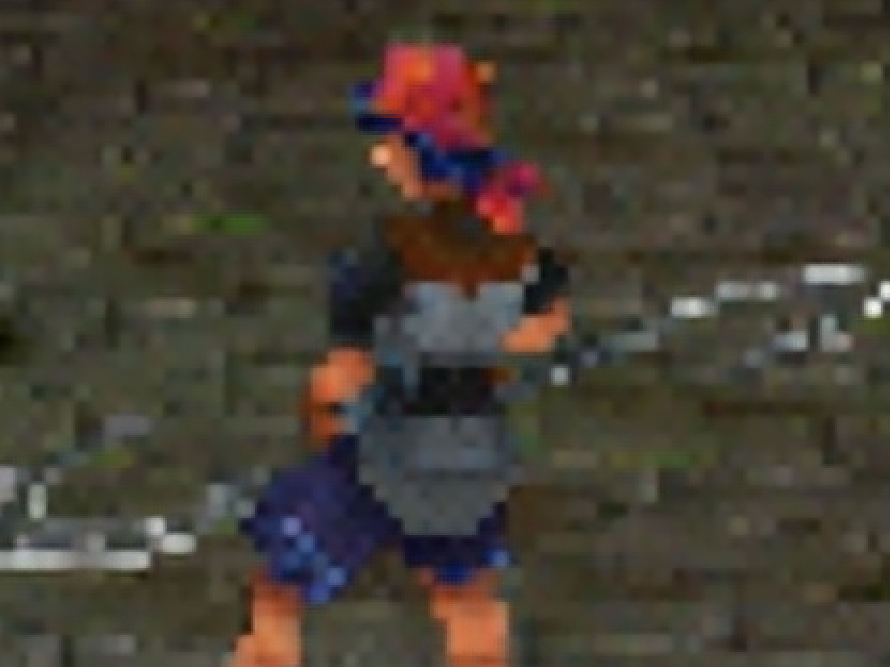

### Super Resolution Strong & Upscaling Strength set to 0.15

| Source | In Resolution & Scale | NN | Bicubic | Lanczos | SuperRes | Upscaling |
| :--- | :---: | :---: | :---: | :---: | :---: | :---: |
| Ogre Battle 64 (N64) | 640x480 - 3x |  |  |  |  |  |
| Ogre Battle 64 (N64) | |  |  |  |  |  |
| Chrono Cross (PSX) | 640x480 - 4x |  |  |  |  |  |
| Chrono Cross (PSX) | |  |  |  |  |  |
| Chrono Cross (PSX) | |  |  |  |  |  |
| Killzone 2 (PS3) | 1280x720 - 3x |  |  |  |  |  |
| Killzone 2 (PS3) | |  |  |  |  |  |
| Killzone 2 (PS3) | |  |  |  |  |  |